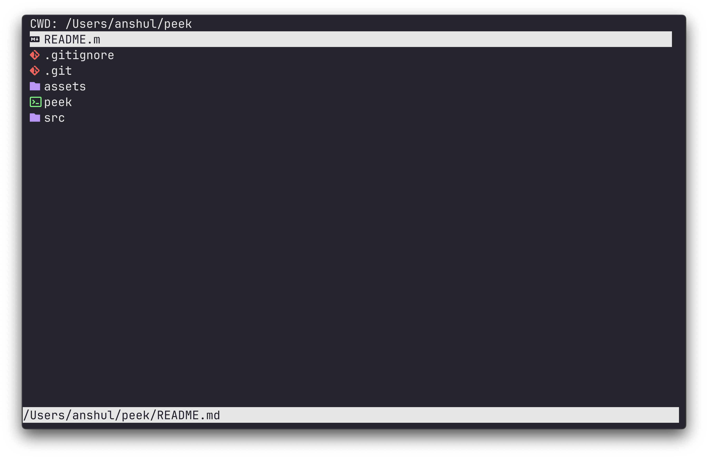

# peek



A lightweight, fast terminal file browser.

> Because MacOS finder sucks

## Usage

| Key | Action |
|-----|--------|
| `↑/k` | Move up |
| `↓/j` | Move down |
| `l/Enter` | Open directory/file |
| `h` | Go to parent directory |
| `/` | Search mode |
| `n/N` | Next/previous search match |
| `r` | Rename file/directory |
| `d` | Delete file/directory |
| `q` | Quit |

```bash
# Prerequisites
brew install ncurses
brew tap homebrew/cask-fonts
brew install --cask font-hack-nerd-font

# install
make
sudo make install
peek

# Compile command
g++ src/main.cpp src/utils.cpp src/actions.cpp -o peek -Wall -Wextra -std=c++17 -lncurses

# Browse current directory
./peek

# Browse specific directory
./peek /path/to/directory
